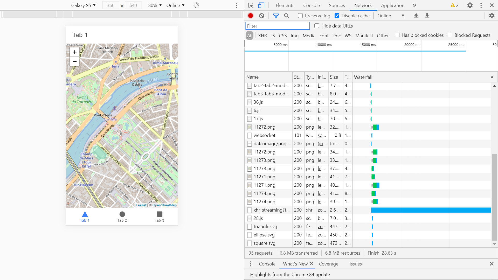

# :zap: Ionic Angular Tutorial

* App to show a map view of user location using [Leaflet](https://leafletjs.com/) & the [Ionic 5 framework](https://ionicframework.com/docs).

## :page_facing_up: Table of contents

* [:zap: Ionic Angular Tutorial](#zap-ionic-angular-tutorial)
  * [:page_facing_up: Table of contents](#page_facing_up-table-of-contents)
  * [:books: General info](#books-general-info)
  * [:camera: Screenshots](#camera-screenshots)
  * [:signal_strength: Technologies](#signal_strength-technologies)
  * [:floppy_disk: Setup](#floppy_disk-setup)
  * [:computer: Code Examples](#computer-code-examples)
  * [:cool: Features](#cool-features)
  * [:clipboard: Status & To-do list](#clipboard-status--to-do-list)
  * [:clap: Inspiration](#clap-inspiration)
  * [:envelope: Contact](#envelope-contact)

## :books: General info

* [Leaflet](https://leafletjs.com/) has lots of options for map control & user interaction

## :camera: Screenshots



## :signal_strength: Technologies

* [Ionic v5](https://ionicframework.com/)
* [Angular v10](https://angular.io/)
* [Ionic/angular v5](https://www.npmjs.com/package/@ionic/angular)
* [Leaflet v1.6](https://leafletjs.com/) open-source JavaScript library for mobile-friendly interactive maps

## :floppy_disk: Setup

* To start the server on _localhost://8100_ type: 'ionic serve'

## :computer: Code Examples

* Basic setup to show the Eiffel Tower on a map

```typescript
ngOnInit() {
    this.map = L.map('map', {
      // center on the coordinates for the eiffel tower
      center: [48.858093, 2.294694],
      zoom: 15,
      renderer: L.canvas()
    })

    L.tileLayer('https://{s}.tile.openstreetmap.org/{z}/{x}/{y}.png', {
      attribution: '&copy; <a href="http://www.openstreetmap.org/copyright">OpenStreetMap</a>'
    }).addTo(this.map)

    setTimeout(() => {
      this.map.invalidateSize();
    }, 0)

  }
```

## :cool: Features

* free map

## :clipboard: Status & To-do list

* Status: Working
* To-do: nothing

## :clap: Inspiration

* [Technbuzz: Add leaflet in Ionic Angular](https://www.youtube.com/watch?v=L-izDYEeJmA)]

## :envelope: Contact

* Repo created by [ABateman](https://www.andrewbateman.org) - you are welcome to [send me a message](https://andrewbateman.org/contact)
