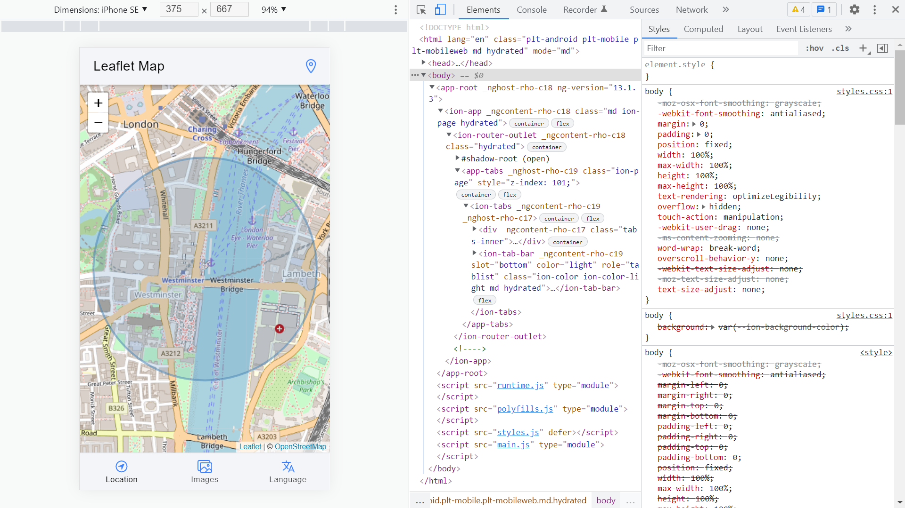
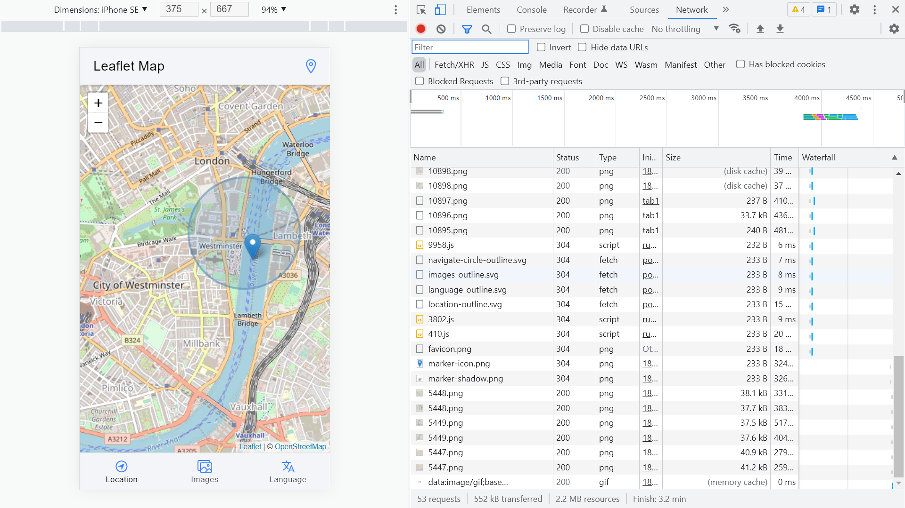

# :zap: Ionic Angular Tutorial

* App to show a map view of user location with an animated marker using [Leaflet](https://leafletjs.com/), [Leaflet Bouncemaker v1](https://github.com/maximeh/leaflet.bouncemarker) & the [Ionic framework](https://ionicframework.com/docs).
* Tutorial code from [Technbuzz](https://www.youtube.com/channel/UCrG1x1CG8Jpjd2IZhrw9PsA) with modifications
* **Note:** to open web links in a new window use: _ctrl+click on link_


## :page_facing_up: Table of contents

* [:zap: Ionic Angular Tutorial](#zap-ionic-angular-tutorial)
  * [:page_facing_up: Table of contents](#page_facing_up-table-of-contents)
  * [:books: General info](#books-general-info)
  * [:camera: Screenshots](#camera-screenshots)
  * [:signal_strength: Technologies](#signal_strength-technologies)
  * [:floppy_disk: Setup](#floppy_disk-setup)
  * [:computer: Code Examples](#computer-code-examples)
  * [:cool: Features](#cool-features)
  * [:clipboard: Status & To-do list](#clipboard-status--to-do-list)
  * [:clap: Inspiration - By Samiullah Khan @Techbuzz](#clap-inspiration---by-samiullah-khan-techbuzz)
  * [:file_folder: License](#file_folder-license)
  * [:envelope: Contact](#envelope-contact)

## :books: General info

* [Leaflet](https://leafletjs.com/) has lots of options for map control & user interaction
* [Leaflet Marker](https://leafletjs.com/reference-1.7.1.html#marker) used to display clickable/draggable icons on the map
* [Leaflet Bouncemaker v1](https://github.com/maximeh/leaflet.bouncemarker) used to add bounce animation to the marker
* Angular no longer comes with linting by default so ESLint was added.

## :camera: Screenshots




## :signal_strength: Technologies

* [Ionic v6](https://ionicframework.com/)
* [Angular v13](https://angular.io/)
* [Ionic/angular v6](https://www.npmjs.com/package/@ionic/angular)
* [Ionicons](https://ionic.io/ionicons)
* [Leaflet v1](https://leafletjs.com/) free open-source JavaScript library for mobile-friendly interactive maps
* [leaflet.bouncemarker v1](https://github.com/maximeh/leaflet.bouncemarker) to make a Marker bounce when you add it on a map

## :floppy_disk: Setup

* Run `npm i` to install dependencies
* To start the server on _localhost://8100_ type: 'ionic serve'
* `ng lint` to lint project - the Ionic boilerplate is old and newer version add `component` to tab component pages. This causes lint errors `error Component class names should end with one of these suffixes: "Component" (https://angular.io/styleguide#style-02-03) @angular-eslint/component-class-suffix`. This could be fixed with a lot of filename changes etc.

## :computer: Code Examples

* Basic setup to show Big Ben on a map

```typescript
ngOnInit() {
    this.map = L.map('map', {
      // center on the coordinates for Big Ben
      center: [51.50148, -0.12351],
      zoom: 15,
      renderer: L.canvas()
    })

    L.tileLayer('https://{s}.tile.openstreetmap.org/{z}/{x}/{y}.png', {
      attribution: '&copy; <a href="http://www.openstreetmap.org/copyright">OpenStreetMap</a>'
    }).addTo(this.map)

    setTimeout(() => {
      this.map.invalidateSize();
    }, 0)

  }
```

## :cool: Features

* Leaflet map is free and does not require an API key.
* [Leaflet Marker bounce](https://github.com/maximeh/leaflet.bouncemarker) is definitely cool

## :clipboard: Status & To-do list

* Status: Working
* To-do: Nothing

## :clap: Inspiration - By Samiullah Khan @Techbuzz

* [Youtube: Add leaflet in Ionic Angular](https://www.youtube.com/watch?v=L-izDYEeJmA)]
* [Youtube: Leaflet markers, Popups and Circle](https://www.youtube.com/watch?v=gBSevKwI3GQ)
* [Article: Add leaflet to Ionic Angular [Screencast]](https://www.technbuzz.com/2020/06/07/add-leaflet-to-ionic-angular/)
* [Article: Markers, Popups & Circle](https://www.technbuzz.com/2020/06/28/add-leaflet-markers-popup-and-circle/)

## :file_folder: License

* This project is licensed under the terms of the MIT license.

## :envelope: Contact

* Repo created by [ABateman](https://github.com/AndrewJBateman), email: gomezbateman@yahoo.com
